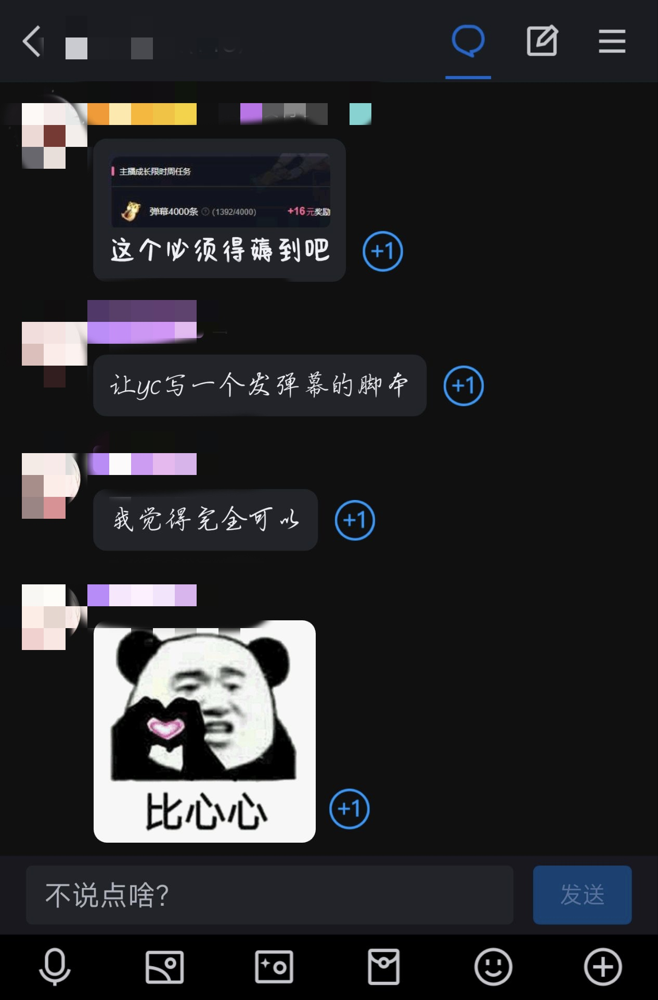

<div align="center">


# VCBOT FOR BILI

一个用于B站的简单机器人框架(基于python)

</div>

## 开发原因

<details>



</details>

## 使用

1. 从[releases](https://github.com/vcbots/vcbot-bili/releases)中获取对应操作系统平台的程序，并解压
2. 创建`.env`文件,并填写以下内容
```
roomid=[房间id]
term_env=[终端扫码，启用填1即可]
```
3. 创建`[房间id].json`,并填写以下内容

<details>
<summary>示例</summary>

```
{
    "connected": "连接成功", 
    "chat":{
        "global":{
            "schedule":[
                {
                    "minute":1,
                    "content": "主包快去喝水！"
                },
                {
                    "minute":15,
                    "content":"q群：xxx"
                }
            ],
            "events":{
                    "reply_notice": " {user} 回复 {re-user} : {content} ",
                    "welcome": "欢迎 {user} 进入直播间",
                    "gifts": "谢谢 {user} 的 {gift} 喵～",
                    "guard": "感谢 {user} 开通 {type} 喵～",
                    "followed": "感谢 {user} 的关注喵～"
            },
            "command":{
                    "你好":"hello world!",
                    "status":"Is running?"
                }
        },
        "xxxx": {
            "alias":[], 
            "command":{
                "你好":"hello!",
                "臭机器人": "???"
            }
        }
    }
} 
```

</details>

<details>
<summary>解析</summary>


### 配置规则解析

|字段|备注|
|-|-|
|connected|连接直播间成功|
|global|全局事件|
|xxx|xxxx为用户uid,特定用户事件|
#### global规则解析

|字段|备注|
|-|-|
|schedule|定时事件|
|events|直播事件|
|command|互动事件|

#### [uid]规则解析

|字段|备注|
|-|-|
|alias|别称，todo|
|command|互动事件|

#### 替换常量

|字段|备注|
|-|-|
|{user}|替换成用户名|
|{re-user}|替换为被@用户|
|{gift}|替换为礼物名称|
|{type} |替换为开通大航海类型|

</details>


4.启动运行，**扫码登陆**后即可

## 开发

```bash
# 安装依赖
pip install -r requirements.txt

# 调试
python3 main.py

# 编译出应用程序
pyinstaller -F --hidden-import=PIL._tkinter_finder --additional-hooks-dir=hooks main.py -n vcbot-bili -i .res/icon.ico

```


